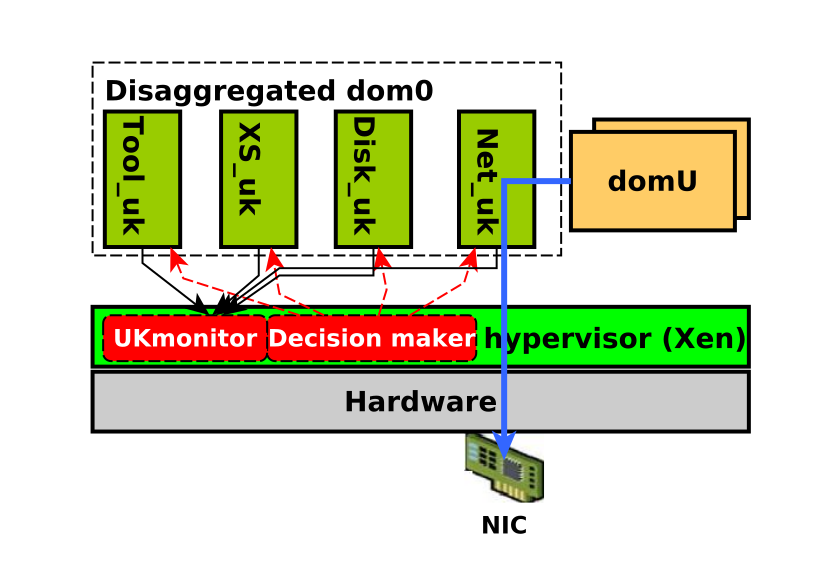

# R-VMM
**Resilient Virtual Machine Monitor** is a complete fault tolerance solution for type-I hypervisors adopting one of the most popular VMM architectures, we refer as "pVM-based". This project leverages unikernel and fault tolerance designs to have deal with the fault tolerance of the "dom0" in the Xen virtualization system.

## Our design

We split the pVM (dom0) in four parts where each part has his dedicated fault tolerance mecanism + a global loop which monitors via heartbeat and trigger recovery mechanisms.  

## Requirements & Deployment

### Requirements

Our Xen hypervisor was compiled on **Ubuntu 12.04.5 LTS with Linux kernel 5.0.8** (but can work on recent Ubuntu versions). 
Our fault tolerance mechanism for the network component is dependent on **Broadcom Corporation NetXtreme II BCM5709
Gigabit Ethernet interface (1Gb/s)** with the driver **bnx2**. Our guest VMs run on **Ubuntu 16.04.5 LTS** 

### Deployment 

To deploy our solution, you need to install our `linux-res` using the standard commands, then build and launch our `xen-res`. 
We have our utility script `pVM-util-script.sh` to deploy and run test scripts. 

#### Clone our repo

First clone our repository in a folder.
	
	`git clone https://github.com/djobiii2078/R-VMM.git`

#### Install Linux

To build and install Linux, run:

	`./pVM-util-script.sh deploy linux`

This will build our linux Kernel, install and reboot your server. Choose your distribution with the kernel Linux 5.0.8.
Next let's run install our Xen-based hypervisor.

#### Install Xen

Run : 

	`./pVM-util-script.sh deploy xen`

It builds Xen and reboot your server. When the grub menu displays, choose the entry with **Xen Hypervisor**.

#### Check install

To check if everything went right, run 

	`./pVM-util-script.sh deploy test`

It should displays the *different parts of architecture* (dom0, xenstore) by defaultdisplays, choose the entry with **Xen Hypervisor**.

#### Check install

To check if everything went right, run 

	`./pVM-util-script.sh deploy test`

It should displays the *different parts of architecture* (dom0, xenstore, netdom and tooldom) by default

# Usage

You use our solution exactly as the Xen hypervisor. You can create virtual machines and work with them. 
Each component is used in a transparent manner. To check out the log messages sent by every component, you can inspect debug messages of xen by : 

	`xl dmesg | grep [SD]` or `dmesg | grep [SD]` (for linux level log messages)

Try crash testing some of our components and analyse their behaviour.

A suite test in the folder **benchmarks** is at your disposal. It is composed of the set of modified benchmarks we used to test our solution *tailbench suite and apache bench*. Please check it out. 

## Get in touch with us.

We love **stars**, it is free, just drop one. :)

Feel free to email us at : 

mvondodb@univ-grenoble-alpes.fr, alain.tchana@ens-lyon.fr, renaud.lachaize@imag.fr 
